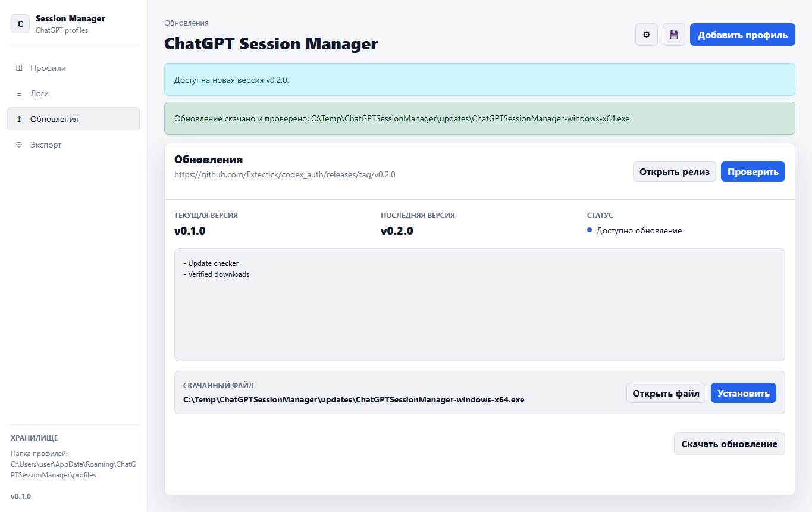

# ChatGPT Session Manager

Windows desktop application for storing local ChatGPT session profiles and
exporting the selected profile to a Codex-compatible `auth.json` file.



## Security Notice

Profiles, tokens, exported `auth.json` files, settings, and logs are stored
locally in plain text. Do not publish these files, attach them to GitHub issues,
or share screenshots that expose token values.

This is an unofficial utility. Use it only on machines where you control access
to the local user profile.

## Download

Use the latest stable build from
[GitHub Releases](https://github.com/Extectick/codex_auth/releases/latest).

| Platform | Status | Artifact |
|---|---|---|
| Windows x64 | Supported | ChatGPTSessionManager-windows-x64.exe |
| Linux x64 | Planned | - |
| macOS | Planned | - |

## Install

1. Download `ChatGPTSessionManager-windows-x64.exe` from the latest release.
2. Place it in a directory where your Windows user can write logs and settings.
3. Run the executable.
4. Add a ChatGPT session profile manually or through the built-in capture flow.
5. Select the active profile to write the target `auth.json`.

No Python installation is required for the release executable.

## Updates

The app checks GitHub Releases, not the `main` branch. User-facing versions are
published only as tags in the `vX.Y.Z` format.

The Updates page can:

- show the current and latest release versions;
- open the latest GitHub Release;
- download `ChatGPTSessionManager-windows-x64.exe`;
- download and verify the matching `.sha256` file;
- run the bundled Windows updater to replace the current executable.

## Run From Source

Requirements:

- Windows
- Python 3.12 or newer
- Microsoft Edge WebView2 runtime

```powershell
python -m venv .venv
.\.venv\Scripts\Activate.ps1
pip install -r requirements.txt
python -m app.main
```

## Build From Source

```powershell
.\build.ps1
```

The local build creates:

```text
dist\ChatGPTSessionManager.exe
```

CI builds may also upload a development artifact named
`ChatGPTSessionManager-windows-x64-dev.exe`. Development artifacts are not stable
user releases.

## Local Data

By default, application data is stored under:

```text
%APPDATA%\ChatGPTSessionManager\
```

The main files and directories are:

```text
profiles\       saved session profiles
settings.json   selected profile and export path
app.log         application log
```

The default export target is:

```text
%USERPROFILE%\.codex\auth.json
```

You can change the export path in the application. When a profile is activated,
the target file is overwritten with the selected session data.

## Manual Import JSON

Manual import expects a JSON object containing:

- `accessToken`
- `sessionToken`
- `account.id`
- `expires`

The profile name is taken from `user.email`, then `user.name`; if both are
missing, the application uses `Профиль N`. `refresh_token` or `refreshToken` is
optional.

## Exported auth.json Format

The exported `auth.json` is written in this shape:

```json
{
  "auth_mode": "chatgpt",
  "OPENAI_API_KEY": null,
  "tokens": {
    "id_token": "<access token>",
    "access_token": "<access token>",
    "refresh_token": "<refresh token>",
    "account_id": "<account id>"
  },
  "last_refresh": "<session expires timestamp>"
}
```

Expired profiles cannot be activated. If the previously selected profile
expires, the app clears the active selection and leaves the existing export file
unchanged.

## Release Process

Maintainers publish user-facing versions only through git tags:

```powershell
git tag v0.1.0
git push origin v0.1.0
```

Pushing a tag matching `vX.Y.Z` runs the release workflow. The workflow builds
the Windows executable, creates a SHA256 checksum, and attaches both files to a
GitHub Release.

Regular pushes to `main` run CI and produce a development artifact, but they do
not create a GitHub Release.

Before tagging a release:

```powershell
python -m compileall app tests
python -m pytest -q
node --check app/web/app.js
```

Update `app/version.py` and `CHANGELOG.md` before creating the tag.

## License

This project is released under the [MIT License](LICENSE).

## Security

See [SECURITY.md](SECURITY.md) before opening issues that may involve tokens,
profiles, logs, or exported session files.
